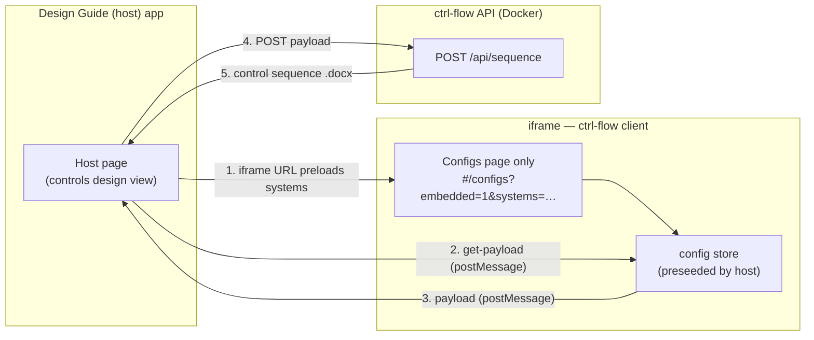
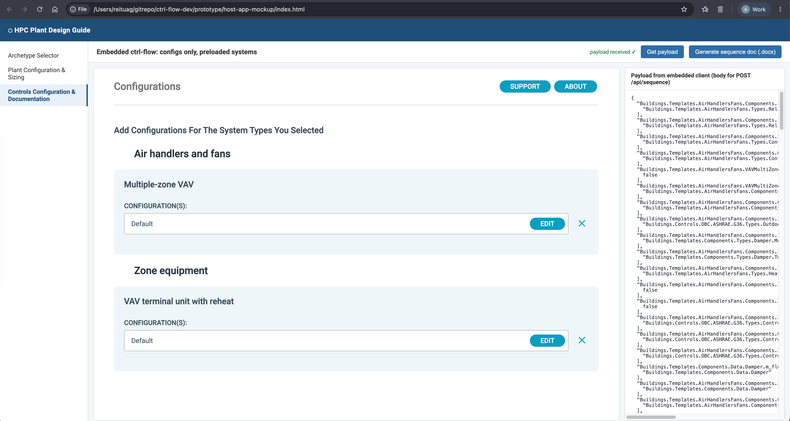

# Embedding ctrl-flow in the Design Guide

**Working prototype**:

- The Design Guide ("host") embeds only the **configs step** of ctrl-flow, preloaded with a host-selected subset of systems.
- The user configures them inside the embed; the host retrieves the resulting payload and calls ctrl-flow API to generate the control sequence document.

>[!note]
>
>Deployed client reused as-is (iframe + postMessage), with only small additions for proper embedding.

## Demo

1. API container running on port 3000.
2. Client: `PORT=3001 npm start --prefix=client`
3. Open `host-app-mockup/index.html` in a browser → configs page appears with two preloaded systems → **Get payload** → **Generate sequence doc (.docx)**

## Key Takeaways

- **Simple path** because the client is nearly self-contained: templates are bundled into the JS build (no backend call), "selecting a system" is just creating a config record, and the API payload only depends on the config store.
- **The host discovers available systems from a slim `catalog.json`** (build-time artifact) and filters by package prefix — e.g. `Buildings.Templates.Plants.HeatPumps`
- **TODO for production**: `catalog.json` generation, API auth + CORS allowlist, structured errors, async job pattern for the minutes-long document generation, and a versioned postMessage protocol.
